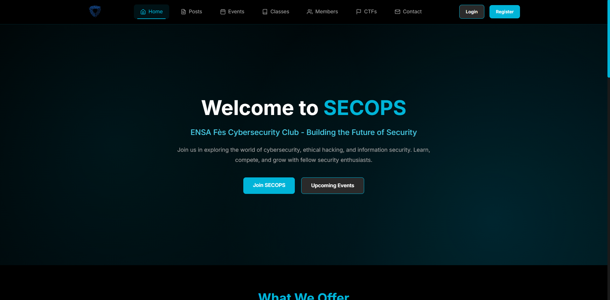
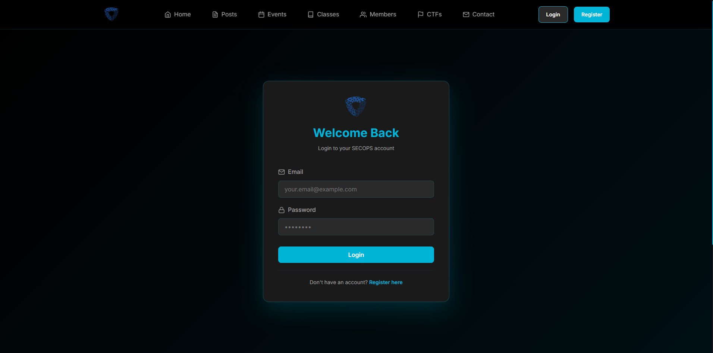
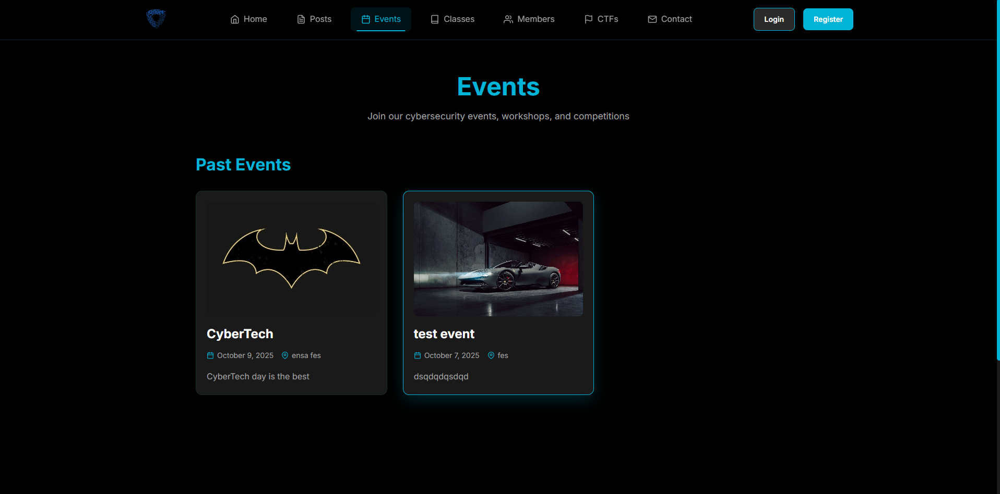
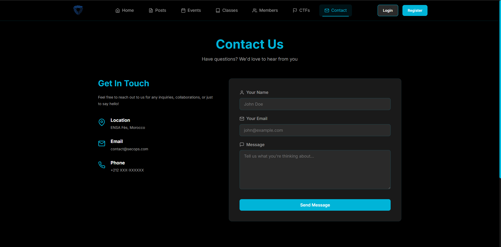

# SecOps Home — Security Operations Dashboard



A modern, responsive Security Operations (SecOps) dashboard built with a frontend and backend, designed to manage events, clubs, contacts and administrative workflows for a security-focused community or organization. This README replaces the placeholder and integrates the screenshots you uploaded — AdminScreen.png, ClubsScreen.png, ContactScreen.png, EventsScreen.png, HomeScreen.png and LoginScreen.png — so maintainers and users can quickly see the UI and get started.

---

## Table of Contents

- [Overview](#overview)  
- [Screenshots](#screenshots)  
- [Features](#features)  
- [Requirements](#requirements)  
- [Quick start](#quick-start)  
- [Run locally](#run-locally)  
- [Configuration & Customization](#configuration--customization)  
- [Security Considerations](#security-considerations)  
- [Project structure](#project-structure)  
- [Contributing](#contributing)  
- [License](#license)

---

## Overview

SecOps Home is a full-stack application that provides an easy-to-use UI for administrators and members to:
- View dashboards and event summaries
- Manage clubs and contacts
- Handle administrative tasks and security-related workflows

The project is split into `frontend` and `backend` directories so you can run and develop each independently or deploy them together.

---

## Screenshots

All screenshots are in the repository root and will render on GitHub. Click any image to view a full-size preview.

### Login


### Home


### Events listing 


### Clubs management


### Contacts 


### Admin console


---

## Features

- Responsive dashboard with summary metrics and widgets  
- Events CRUD and timeline view  
- Clubs management (create, edit, members)  
- Contacts directory with search & filters  
- Admin panel for configuration and user roles  
- Extensible modular frontend and pluggable backend endpoints

---

## Requirements

- Node.js 16+ (for frontend)
- npm or yarn
- Python 3.8+ or Node/your chosen runtime for backend (see backend README)
- Git
- Optional: Docker & Docker Compose for containerized setup

See `SETUP_GUIDE.md` and `CUSTOMIZATION.md` for environment-specific requirements and recommendations.

---

## Quick start

Clone the repository and follow the steps below to run locally.

```bash
# clone
git clone https://github.com/b1l4l-sec/secops_home.git
cd secops_home
```

There are two main parts: frontend and backend. Each has its own README/quick-start instructions.

---

## Run locally — Frontend

```bash
# change into frontend
cd frontend

# install
npm install

# start dev server
npm run dev

# open browser at the URL shown (usually http://localhost:5173)
```

---

## Run locally — Backend

Backend technology and run instructions are kept inside the `backend/` folder. A minimal example:

```bash
cd backend

# create python venv (example for Python backend)
python3 -m venv .venv
source .venv/bin/activate
pip install -r requirements.txt

# run the backend (example)
export FLASK_APP=app.py
flask run --host=0.0.0.0 --port=8000
```

If a Node backend:
```bash
cd backend
npm install
npm start
```

Adjust ports and env variables in configuration files. See `SETUP_GUIDE.md` and `CUSTOMIZATION.md` for details.

---

## Configuration & Customization

- `CUSTOMIZATION.md` includes theme, logo and text overrides.
- Environment variables (backend): use `.env` or your platform's secret manager.
- Frontend config: update API base URLs in `frontend/.env` or in `src/config/*`.

Recommended workflow:
1. Copy example configuration files (e.g., `config.example.*`) to active config.
2. Update API endpoints, ports and credentials.
3. Restart services.

---

## Security Considerations

- Never commit secrets (API keys, database credentials) to the repository.
- Use TLS for all production traffic (HTTPS).
- Configure proper authentication and role-based access control in the backend before exposing admin pages.
- Review `SECURITY.md` for best practices and incident reporting information.
- Limit file uploads and validate inputs in backend endpoints to prevent injection and other attacks.

---

## Project structure (high level)

```
secops_home/
├── frontend/          # React/Vue/other frontend app
├── backend/           # API, auth, database integration
├── AdminScreen.png
├── HomeScreen.png
├── EventsScreen.png
├── ClubsScreen.png
├── ContactScreen.png
├── LoginScreen.png
├── README.md
├── SETUP_GUIDE.md
├── CUSTOMIZATION.md
└── IMPORTANT_NOTES.md
```

---

## Contributing

Thanks for your interest! Please follow these steps:

1. Fork the repository  
2. Create a feature branch:
   ```bash
   git checkout -b feature/my-change
   ```
3. Make changes and include tests where applicable  
4. Commit and push:
   ```bash
   git add .
   git commit -m "feat: short description"
   git push origin feature/my-change
   ```
5. Open a Pull Request and describe your changes and screenshots if UI changed

---

## License

This project is provided under the MIT License — see the `LICENSE` file for details.

---

If you'd like, I can:
- commit this README for you on a new branch and open a Pull Request (I will provide the exact git commands for you to run), or
- generate a patch file you can apply locally.

Which would you prefer?
